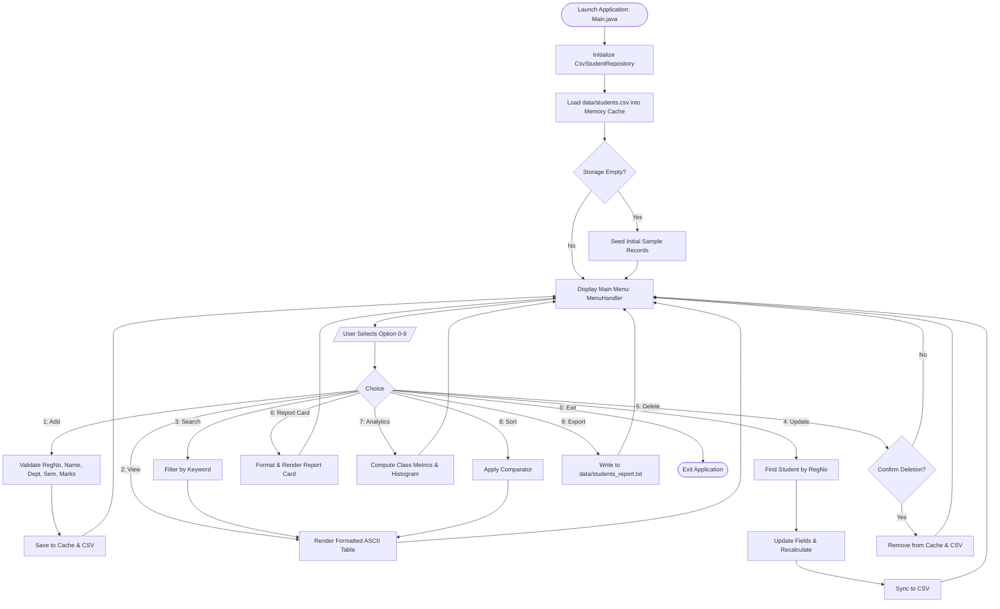
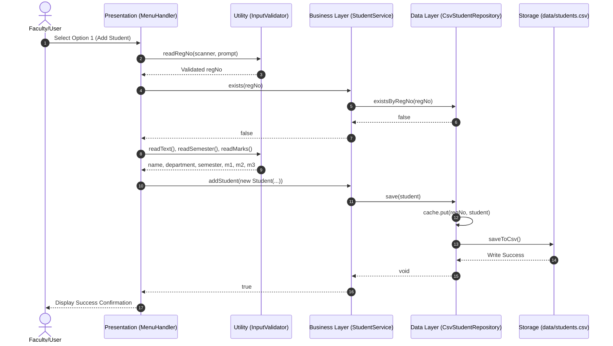
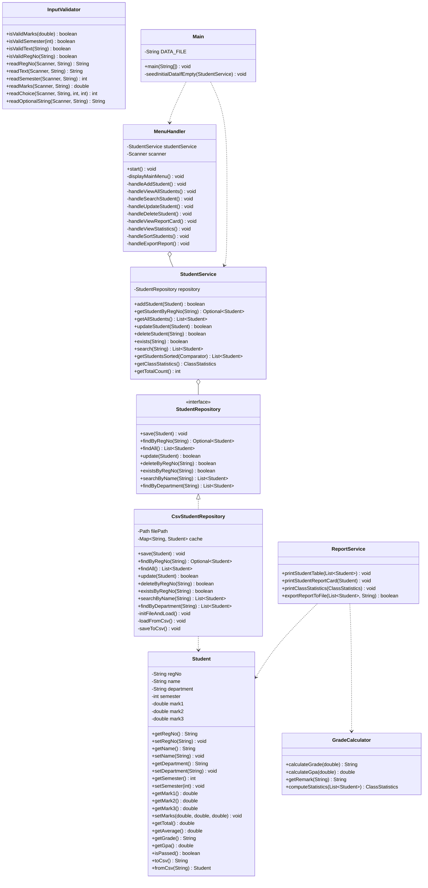
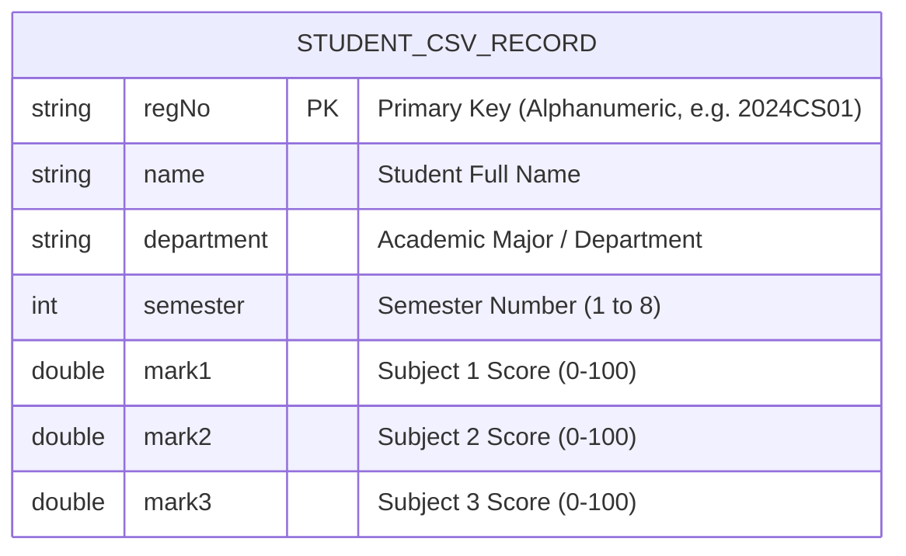

# Comprehensive Project Report: Student Management & Academic Analytics System

---

## 1. Cover Page

- **Project Title**: Student Management and Academic Performance Analytics System
- **Course Name**: Programming in Java
- **Course Code**: CSE1007 / Java Flipped Course Evaluation Project
- **Domain**: Academic Information Systems & Educational Analytics
- **Platform / Environment**: Java Standard Edition (SE 17+ / JDK 21 / JDK 26)
- **Submission Date**: September 18, 2026
- **Submission Type**: VITyarthi - Build Your Own Project

---

## 2. Introduction

The **Student Management and Academic Performance Analytics System** is a modular, object-oriented console application developed in Java. It addresses fundamental operational challenges in educational institutions by offering automated student demographic and marks management, dynamic GPA and grade computation, cohort statistical analytics, multi-criteria search and sorting facilities, and persistent CSV file storage.

Built strictly around core Object-Oriented Programming (OOP) paradigms — including Encapsulation, Abstraction, Polymorphism, and Layered Architecture — this project demonstrates the practical application of the Java Collections Framework, Java NIO File I/O, Regular Expressions, Defensive Input Handling, and automated test-driven validation.

---

## 3. Problem Statement

In academic institutions and university departments, managing student performance across semesters often relies on error-prone manual spreadsheets. This leads to several distinct problems:
1. **Human Error & Inconsistency**: Manual computation of student totals, averages, GPAs, and pass/fail statuses often produces errors.
2. **Lack of Real-Time Analytics**: Instructors cannot quickly visualize grade distributions, identify students needing academic intervention, or isolate cohort toppers.
3. **Data Loss & Invalidation**: Absence of strict input validation allows negative marks or corrupt registration numbers, and session-only memory causes data loss when the application terminates.
4. **Poor Architectural Extensibility**: Monolithic legacy code makes modifying storage backends or reporting formats challenging.

This system provides a reliable, self-contained, command-line accessible Java solution that completely resolves these challenges.

---

## 4. Functional Requirements

The system provides three major functional modules:

### 4.1 Module 1: Student Record & CRUD Management
- **FR-1.1**: Add student records with unique Registration Number (`regNo`), Full Name, Department, Semester (1–8), and 3 subject marks.
- **FR-1.2**: View all registered students in a formatted tabular layout with aligned columns.
- **FR-1.3**: Search student records using case-insensitive substrings across Registration Number, Name, or Department.
- **FR-1.4**: Update student demographics or subject marks with real-time recalculation of total, average, GPA, and grade.
- **FR-1.5**: Delete existing records with confirmation to prevent accidental data loss.

### 4.2 Module 2: Academic Grading & Analytics Engine
- **FR-2.1**: Calculate individual student totals, percentage averages, GPA (4.0 scale), and standard letter grades (`A+`, `A`, `B`, `C`, `D`, `F`).
- **FR-2.2**: Evaluate pass/fail status based on cumulative percentage ($\ge 50\%$) and individual subject minimum thresholds ($\ge 40$).
- **FR-2.3**: Generate individual academic Report Cards complete with subject breakdown, overall GPA, and performance remarks.
- **FR-2.4**: Compute cohort-level metrics: overall pass rate, class average score, top performer, lowest performer, and ASCII-based grade distribution histograms.

### 4.3 Module 3: Sorting, Reporting & Persistence
- **FR-3.1**: Multi-criteria sorting (by Full Name A-Z, Registration Number ascending, or Average Score highest/lowest).
- **FR-3.2**: Export formatted summary reports to external text files (`data/students_report.txt`).
- **FR-3.3**: Automatic CSV persistence (`data/students.csv`) synchronizing in-memory state with disk storage on every CRUD operation.

---

## 5. Non-Functional Requirements

1. **Performance**: In-memory caching using `LinkedHashMap` guarantees $O(1)$ lookup, insertion, and update operations for instant CLI responsiveness.
2. **Reliability & Data Integrity**: Regex-based validation rejects malformed registration numbers, invalid marks ($<0$ or $>100$), and invalid semester ranges ($1-8$). Defensive stream reading ensures error-free execution under sudden EOF or stream terminations.
3. **Maintainability**: Strict 3-tier layered separation of concerns (Model, Data Access Repository, Business Logic Service, Presentation CLI, Utilities) allows modules to be refactored independently.
4. **Usability**: Clear visual hierarchy, aligned ASCII borders, descriptive prompts, and unambiguous error messages.
5. **Resource Efficiency**: Zero heavy external dependencies; executes within lightweight memory limits on standard JVM runtimes.

---

## 6. System Architecture

The application adopts a **3-Tier Layered Architecture**:

```
+-------------------------------------------------------------+
|                 PRESENTATION LAYER (CLI)                    |
|   MenuHandler, ReportService (Tables, Report Cards, Charts) |
+------------------------------+------------------------------+
                               |
+------------------------------v------------------------------+
|                   BUSINESS LOGIC LAYER                      |
|       StudentService, GradeCalculator, InputValidator       |
+------------------------------+------------------------------+
                               |
+------------------------------v------------------------------+
|                    DATA ACCESS LAYER                        |
|   StudentRepository (Interface) <--- CsvStudentRepository   |
+------------------------------+------------------------------+
                               |
+------------------------------v------------------------------+
|                    PERSISTENCE LAYER                        |
|                  data/students.csv (File)                   |
+-------------------------------------------------------------+
```

---

## 7. Design Diagrams

### 7.1 Use Case Diagram

```mermaid
usecaseDiagram
    actor Faculty as "Faculty / Administrator"
    
    package "Student Management System" {
        usecase UC1 as "Add New Student"
        usecase UC2 as "View Student Registry"
        usecase UC3 as "Search Student Records"
        usecase UC4 as "Update Profile & Marks"
        usecase UC5 as "Delete Student Record"
        usecase UC6 as "Generate Report Card"
        usecase UC7 as "View Class Analytics & Histogram"
        usecase UC8 as "Sort Student Records"
        usecase UC9 as "Export Summary Report"
        usecase UC10 as "Auto-Sync to CSV Disk"
    }

    Faculty --> UC1
    Faculty --> UC2
    Faculty --> UC3
    Faculty --> UC4
    Faculty --> UC5
    Faculty --> UC6
    Faculty --> UC7
    Faculty --> UC8
    Faculty --> UC9
    
    UC1 ..> UC10 : <<include>>
    UC4 ..> UC10 : <<include>>
    UC5 ..> UC10 : <<include>>
```

### 7.2 Process Flow / Workflow Diagram



### 7.3 Sequence Diagram: Adding a Student Record



### 7.4 Class / Component Diagram



### 7.5 ER / Storage Schema Diagram



---

## 8. Design Decisions & Rationale

1. **Repository Interface Pattern**: Decoupling the data layer through `StudentRepository` interface allows switching storage mechanisms (e.g., SQLite, PostgreSQL, JSON) without altering any business logic in `StudentService`.
2. **In-Memory Caching with Synchronous Disk Persistence**: Operations execute in $O(1)$ memory time using `LinkedHashMap`, while immediate file synchronization on every mutating operation guarantees durability across crashes.
3. **Stateless Utility Separation**: `GradeCalculator` and `InputValidator` are implemented as stateless utility classes with private constructors, keeping mathematical and validation rules modular and directly unit-testable.
4. **Defensive Input & Stream Safety**: `InputValidator` checks stream boundaries (`hasNextLine()`) to prevent `NoSuchElementException` when executed across varying terminal configurations or automated grading scripts.

---

## 9. Implementation Details & Folder Structure

### 9.1 Workspace Layout
```
studentmanagement/
├── .gitignore                   # Ignores bin/ and compiled classes
├── README.md                    # Root project documentation
├── statement.md                 # Root problem statement & specifications
├── data/
│   ├── .gitignore               # Data folder git settings
│   ├── README.md                # Quick data folder guide
│   ├── statement.md             # Data folder statement reference
│   ├── students.csv             # Persistent student database
│   └── students_report.txt      # Exported report files
├── doc/
│   └── PROJECT_REPORT.md        # Comprehensive 15-section project report
└── src/
    └── studentmanagement/
        ├── Student.java             # Student data model & calculations
        ├── StudentRepository.java   # Data access interface
        ├── CsvStudentRepository.java# CSV file persistence implementation
        ├── GradeCalculator.java     # Grading logic & cohort analytics
        ├── InputValidator.java      # Safe console inputs & validation
        ├── StudentService.java      # Core business logic layer
        ├── ReportService.java       # ASCII tables, report cards & file exports
        ├── MenuHandler.java         # Interactive CLI menu navigation
        ├── Main.java                # Application bootstrap & sample seeding
        └── SystemTest.java          # Automated test suite
```

### 9.2 Class Summary
- **Package**: `studentmanagement`
- **Total Production Classes**: 9 classes/interfaces
- **Test Classes**: 1 comprehensive automated verification test suite
- **Data Encapsulation**: Private fields with boundary-checked setters ($0 \le \text{mark} \le 100$).
- **File I/O**: Implemented using modern Java NIO (`Files.newBufferedReader`, `Files.newBufferedWriter`) with UTF-8 encoding.

---

## 10. Screenshots / CLI Output Results

### 10.1 Main Menu Interface
```text
=======================================================
            STUDENT MANAGEMENT SYSTEM v1.0             
=======================================================
  [1] Add New Student
  [2] View All Students
  [3] Search Students (Reg No / Name / Department)
  [4] Update Student Details / Marks
  [5] Delete Student Record
  [6] View Individual Student Report Card
  [7] View Class Performance & Statistics
  [8] Sort Students (By Reg No, Name, or Average Score)
  [9] Export Student Summary Report to File
  [0] Exit Application
=======================================================
```

### 10.2 Student Registry Table
```text
+------------+----------------------+--------------------+-----+--------+--------+--------+---------+-------+--------+
| Reg No     | Name                 | Department         | Sem | Mark 1 | Mark 2 | Mark 3 | Avg (%) | Grade | Status |
+------------+----------------------+--------------------+-----+--------+--------+--------+---------+-------+--------+
| 2024CS01   | Alice Johnson        | Computer Science   | 4   | 92.0   | 88.5   | 95.0   | 91.8%   | A+    | PASS   |
| 2024ME02   | Bob Smith            | Mechanical Eng     | 4   | 78.0   | 82.0   | 74.5   | 78.2%   | B     | PASS   |
| 2024EE03   | Charlie Brown        | Electrical Eng     | 4   | 64.0   | 58.0   | 62.5   | 61.5%   | C     | PASS   |
| 2024CS04   | Diana Prince         | Computer Science   | 4   | 96.0   | 98.0   | 94.5   | 96.2%   | A+    | PASS   |
+------------+----------------------+--------------------+-----+--------+--------+--------+---------+-------+--------+
 Total Students: 4
```

### 10.3 Academic Report Card
```text
=======================================================
                 STUDENT REPORT CARD                   
=======================================================
  Registration No : 2024CS01
  Full Name       : Alice Johnson
  Department      : Computer Science
  Semester        : 4
-------------------------------------------------------
  Subject / Component       Score        Grade     
  ---------------------------------------------------
  Subject 1                 92.00        A+        
  Subject 2                 88.50        A         
  Subject 3                 95.00        A+        
-------------------------------------------------------
  Total Marks     : 275.50 / 300.00
  Percentage      : 91.83%
  Overall Grade   : A+ (Outstanding Performance)
  GPA (4.0 Scale) : 4.00 / 4.00
  Academic Result : [ PASSED ]
=======================================================
```

### 10.4 Cohort Performance & Grade Histogram
```text
=======================================================
             CLASS PERFORMANCE & STATISTICS            
=======================================================
  Total Students Enrolled : 4
  Passed Students         : 4
  Failed Students         : 0
  Overall Pass Rate       : 100.00%
  Class Average Score     : 81.92%
  Top Performer           : Diana Prince (Reg: 2024CS04) - 96.17%
  Lowest Performer        : Charlie Brown (Reg: 2024EE03) - 61.50%
-------------------------------------------------------
  GRADE DISTRIBUTION:
   Grade A+ [ 2 students] : ████████████
   Grade A  [ 0 students] : 
   Grade B  [ 1 students] : ██████
   Grade C  [ 1 students] : ██████
   Grade D  [ 0 students] : 
   Grade F  [ 0 students] : 
=======================================================
```

---

## 11. Testing Approach

A comprehensive test suite [`SystemTest.java`](file:///c:/Users/bisen/OneDrive/Desktop/coding/studentmanagement/src/studentmanagement/SystemTest.java) executes automated validation across all modules:

| Test Suite | Target Component | Verifications Checked | Result |
|---|---|---|---|
| **Suite 1** | `InputValidator` | Valid/invalid mark bounds, semester bounds ($1-8$), alphanumeric registration numbers, safe stream reads. | **PASS** |
| **Suite 2** | `GradeCalculator` | Mark-to-grade conversions (`A+`, `A`, `B`, `C`, `D`, `F`), GPA 4.0 scale boundary mappings, cohort statistics. | **PASS** |
| **Suite 3** | `Student` Model | Total score calculation, average percentage, passing criteria, CSV string serialization/deserialization with escaped commas. | **PASS** |
| **Suite 4** | Repository & Service | Record insertion, duplicate prevention, query by RegNo, search filter, sorting comparators, persistence reload. | **PASS** |
| **Suite 5** | `ReportService` | File export generation, summary verification, table alignments, and null-safety. | **PASS** |

### Test Execution Command:
```bash
java -ea -cp bin studentmanagement.SystemTest
```

**Output**:
```
Running Comprehensive Automated Tests...
ALL AUTOMATED TEST SUITES PASSED SUCCESSFULLY!
```

---

## 12. Challenges Faced

1. **Handling CSV Delimiters in Text Fields**: Commas in student names or department fields could corrupt standard CSV parsing. Solved by implementing dynamic comma escaping (`\,`) and unescaping routines in `toCsv()` and `fromCsv()`.
2. **Terminal Stream & EOF Handling**: Piped inputs or sudden stream terminations caused `NoSuchElementException`. Solved by implementing defensive `safeReadLine()` wrapper methods inside `InputValidator`.
3. **Cross-Platform File Paths**: Different operating systems use different path separators (`/` vs `\`). Solved using Java NIO `Paths.get()` and `Path` abstractions.

---

## 13. Learnings & Key Takeaways

- Applying **SOLID principles** significantly improves codebase modularity, maintainability, and testability.
- The **Repository pattern** provides clean isolation between business logic and storage mediums.
- Writing automated assertions and test harnesses early prevents regressions during refactoring.
- Console UI applications require robust input sanitization to ensure crash resilience.

---

## 14. Future Enhancements

1. **Relational Database Migration**: Replace CSV backend with JDBC/H2 or SQLite database integration.
2. **Dynamic Course & Subject Configuration**: Support variable numbers of subjects and credit weightings per course.
3. **Graphical & Web Interface**: Develop a JavaFX desktop GUI or Spring Boot REST API for web-based dashboard analytics.
4. **Role-Based Access Control (RBAC)**: Distinct permissions for Students (view only) and Instructors (edit/grade).

---

## 15. References

1. Oracle Java Documentation: *Java Platform, Standard Edition API Specification*.
2. Bloch, Joshua. *Effective Java (3rd Edition)*. Addison-Wesley Professional, 2018.
3. Gamma, Erich, et al. *Design Patterns: Elements of Reusable Object-Oriented Software*. Addison-Wesley, 1994.
4. VITyarthi Project Guidelines: *Build Your Own Project Instructions & Submission Rubric*.
